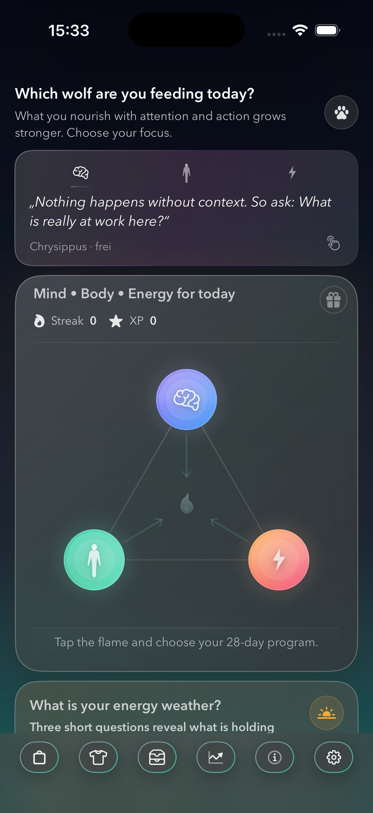
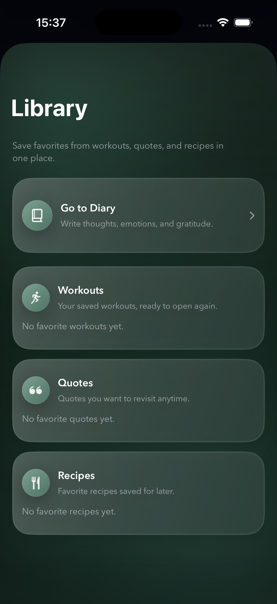

# OZLife

  

  <strong>Small daily routines for Body, Mind &amp; Energy.</strong>

  A native iOS wellness companion for bringing more clarity, movement, 
  and everyday energy into the day—one manageable action at a time.

> **Public product showcase**
>
> The production application and its source code remain private. The visuals shown here are publication-safe exports from the current pre-release OZLife experience.

## Why OZLife?

Wellbeing plans often begin by asking for more: more time, more discipline, more change.

OZLife begins with the day already in front of you. Choose a focus, take one approachable action, and notice what it changes. Small steps become visible progress over time, supported by thoughtful guidance and light rewards rather than performance pressure.

## Mind · Body · Energy

### Mind

**Create a little more space between thought and reaction.**

Short games and thoughtful practices offer a calmer place to return to. A daily pick makes it easy to begin, while different game formats keep focus practice varied and approachable.

   
  Mind Games — Daily Pick and focus activities

### Body

**Bring movement back into the day without needing a perfect schedule.**

Guided sessions keep the current exercise, instruction, and progress together in one clear view. Movement can fit the day as it is, rather than waiting for ideal conditions.

   
  Guided movement with clear session progress

### Energy

**Notice what drains, restores, and quietly shapes everyday life.**

Weekly review turns short check-ins into patterns that are easier to understand. The emphasis stays on reflection and practical awareness—not on turning wellbeing into a score.

   
  A weekly view of energy patterns and influences

## One day with OZLife

**Choose a focus** → **Take one small action** → **Notice the effect** → **Build visible progress**

The Daily Hub brings that rhythm together in one place. Mind, Body, and Energy remain visible as parts of the same day, with a clear next step and progression that grows through consistency.

   
  The Daily Hub — focus, action, and progress in one view

## Beyond the daily rhythm

OZLife also creates places to return to: a Library for saved workouts, quotes, and recipes, and a Garage that turns continued participation into visible avatar progression.

   
  Library — saved practices and personal favourites

   
  Garage — an avatar and progression you can see

## Product highlights

- **Daily rhythm** — A calm hub connects focus, small actions, reflection, and visible progress.
- **Mind** — Short games and thoughtful practices create space for attention and reflection.
- **Body** — Guided sessions and adaptable routines bring movement into real schedules.
- **Energy** — Check-ins and weekly patterns make everyday influences easier to notice.
- **Reflection and privacy** — Personal entries, saved content, and optional protection support a private place to return to.
- **Progression and rewards** — XP, streaks, milestones, avatars, and collectibles make consistency tangible without turning it into a contest.

Explore the complete [feature overview](docs/features.md).

## A calmer kind of progression

OZLife makes consistency visible without making personal wellbeing a contest. Its progression systems are designed to support return and recognition—not urgency or comparison.

> Choose what matters today. Take a small step. Notice its effect. Continue when the next day arrives.

## Built for iOS

OZLife is a native iOS application written in **Swift** and **SwiftUI**, centered on Daily, Mind, Body, Energy, Diary, Nutrition, and Garage experiences. Progress and personal content are designed primarily around local, on-device use, with optional Apple platform integrations remaining under user control.

See the [public architecture overview](docs/architecture.md).

## Product status

OZLife is **in active pre-release development**. This does not imply App Store availability, completed release testing, or a guaranteed release date.

Current product direction is documented in the [non-binding roadmap](docs/roadmap.md).

## Privacy and wellness

OZLife includes experiences for personal reflection, journaling, and optional health integration, with an emphasis on user choice and careful handling of personal content.

OZLife is a general wellness and routine companion. It is not a medical device and does not replace professional advice, diagnosis, or treatment. Read [Privacy and safety](docs/privacy-and-safety.md).

## Follow the journey

OZLife is growing toward release. This repository documents the public product experience as it continues to take shape.

Watch the repository to follow development progress, or use [GitHub Issues](../../issues) for product questions.

## Proprietary source and license

The production source code for OZLife is maintained privately and is not included or distributed in this repository. This showcase is public for viewing, demonstration, and evaluation only; it is not an open-source project.

All rights are reserved. See [LICENSE](LICENSE) and [NOTICE](NOTICE.md) for the applicable terms.

## Contact

For documentation feedback, general product questions, security-report coordination, or licensing enquiries, use [GitHub Issues](../../issues).

  <strong>OZLife</strong> 
  Small daily routines for Body, Mind &amp; Energy.

© 2026 Cloddy Web. All rights reserved.

