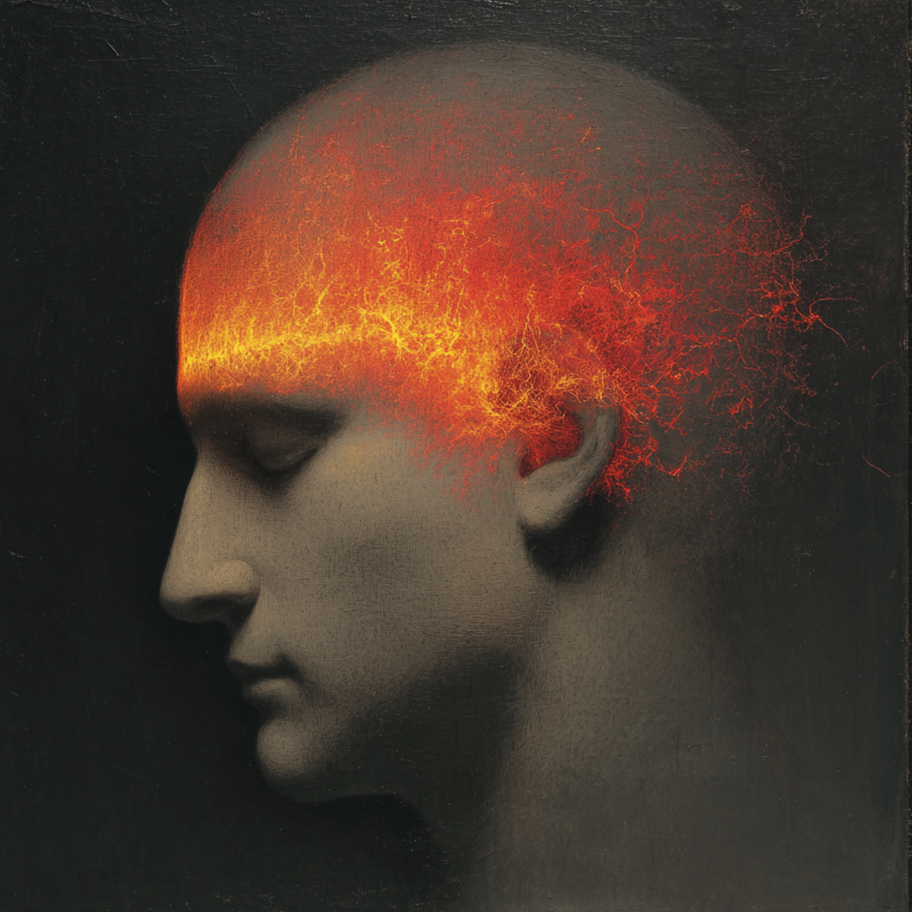
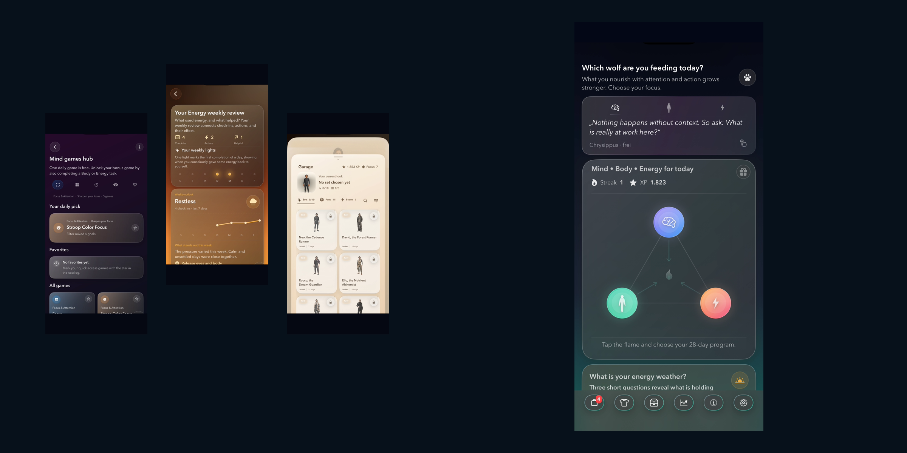
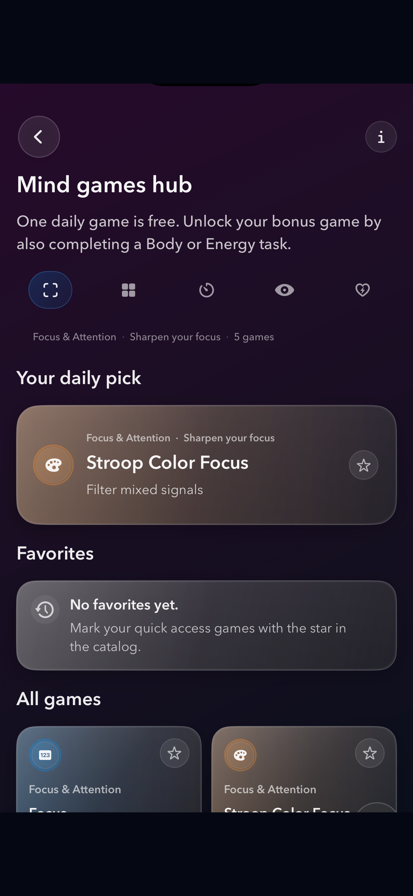
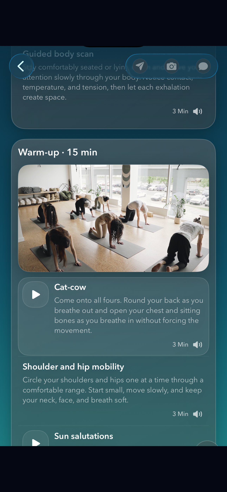
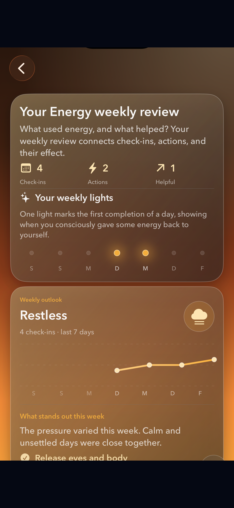
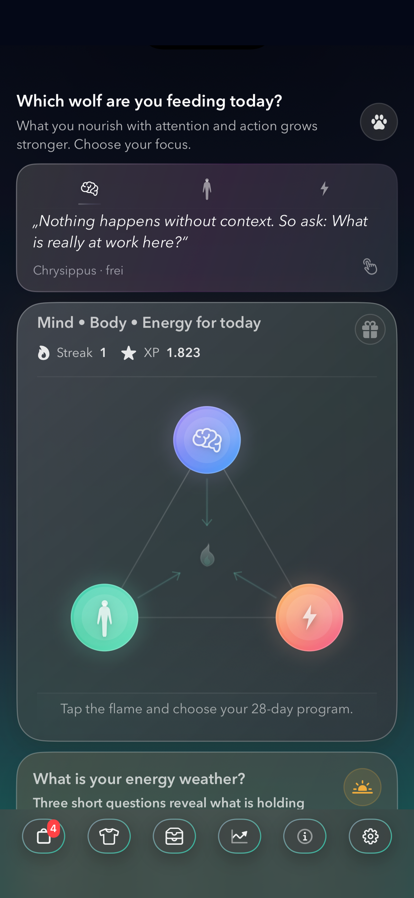
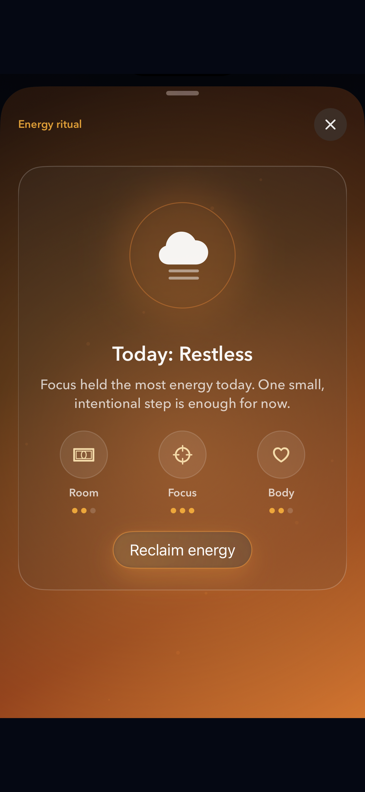
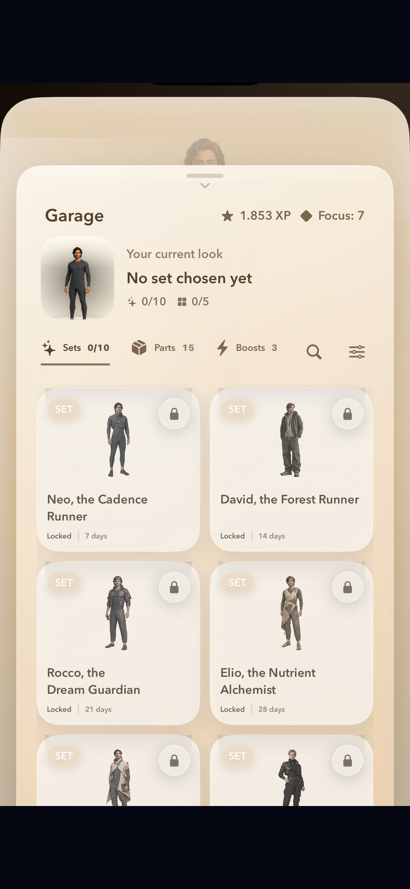
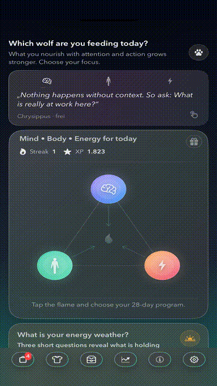

# OZLife

  

  <strong>Small daily routines for Body, Mind &amp; Energy.</strong>

  A native iOS wellness companion for bringing more clarity, movement, 
  and everyday energy into the day—one manageable action at a time.

  

> **Public product showcase**
> The production application and its source code remain private. The visuals shown here are publication-safe exports from the current pre-release OZLife experience.

## Why OZLife?

Wellbeing plans often begin by asking for more: more time, more discipline, more change.

OZLife begins with the day already in front of you. Choose a focus, take one approachable action, and notice what it changes. Small steps become visible progress over time, supported by thoughtful guidance and light rewards rather than performance pressure.

## Mind · Body · Energy

| Mind | Body | Energy |
| :--- | :--- | :--- |
| **Create a little more space between thought and reaction.**  Short games and thoughtful practices offer a calmer place to return to. Build focus in moments that fit the day.   | **Bring movement back into the day without needing a perfect schedule.**  Choose guided sessions that meet your energy where it is. Small, clear movement can still change the shape of a day.   | **Notice what drains, restores, and quietly shapes everyday life.**  Check in without turning wellbeing into a score. Gentle review makes patterns easier to see and act on.   |

The three areas are distinct enough to meet a particular need, and connected enough to support the whole day.

## One day with OZLife

**Choose a focus** → **Take one small action** → **Notice the effect** → **Build visible progress**

| Choose | Act | Continue |
| :--- | :--- | :--- |
|  <strong>Your day at a glance</strong> |  <strong>Choose what your day needs</strong> |  <strong>Let consistency take shape</strong> |

## Screenshot story

|  |  |
| :--- | :--- |
|  **Your day at a glance** |  **Choose what your day needs** |
|  **Move with clear, guided sessions** |  **Train focus through play** |
|  **See what shapes your energy** |  **Turn consistency into visible progress** |

## See OZLife in motion

A short, silent preview of the daily flow, from choosing a focus to visible progress. [Watch or download the MP4 teaser](assets/video/ozlife-teaser.mp4) (21 seconds, 559 KB).

## Product highlights

- **A calmer daily center** — The Daily Hub brings together focus, guidance, activities, progress, rewards, and weekly context.
- **A deliberate starting ritual** — An atmospheric interaction helps people choose Mind, Body, or Energy as the day’s focus.
- **Movement that fits real schedules** — Short workouts, guided sessions, adaptable routines, and structured 28-day paths.
- **Space for focus and reflection** — Mind games, practical prompts, breathing, rest practices, and favorites.
- **Awareness beyond a single score** — The Energy Compass, personal check-ins, weekly patterns, guided mini-sessions, and small experiments.
- **Practical everyday support** — Nutrition basics, recipes, recipe details, and shopping-list support.
- **A private place to return to** — Diary entries, voice notes, saved content, a personal Library, and optional biometric protection.
- **Progress with character** — XP, streaks, milestones, avatars, collectibles, badges, outfits, and visual Garage rewards.
- **Optional depth** — A free daily foundation with optional premium experiences across programs, games, insights, and selected rewards.
- **Apple platform connections** — Optional Apple Health access, notifications, audio, sharing, biometric protection, and a home-screen widget.
- **Multiple languages** — Content structures for German, English, Spanish, and Italian.

Explore the complete [feature overview](docs/features.md).

## A calmer kind of progression

OZLife makes consistency visible without making personal wellbeing a contest. XP, streaks, milestones, 28-day paths, and visual rewards are there to support return and recognition—not urgency or comparison.

> Choose what matters today. Take a small step. Notice its effect. Continue when the next day arrives.

## Built for iOS

OZLife is a native iOS application written in **Swift** and **SwiftUI**. Its product structure centers on Daily, Mind, Body, Energy, Diary, Nutrition, and Garage experiences.

Progress and personal content are designed primarily around local, on-device use. Optional Apple platform integrations remain under user control. This public description is intentionally abstract and does not expose source structure, storage schemas, identifiers, entitlements, or infrastructure.

See the [public architecture overview](docs/architecture.md).

## Product status

OZLife is **in active pre-release development**. This status does not imply App Store availability, completed release testing, or final approval of all media and branding assets.

Current product direction is documented in the [non-binding roadmap](docs/roadmap.md).

## Privacy and wellness

OZLife includes experiences for personal reflection, journaling, and optional health integration. Product decisions in these areas emphasize user choice and careful handling of personal content. OZLife is a general wellness and routine companion. It is not a medical device and does not replace professional advice, diagnosis, or treatment.

Read [Privacy and safety](docs/privacy-and-safety.md).

## Proprietary source and license

The production source code for OZLife is maintained privately and is not included or distributed in this repository. This showcase is public for viewing, demonstration, and evaluation only; it is not an open-source project.

All rights are reserved. See [LICENSE](LICENSE) and [NOTICE](NOTICE.md) for the applicable terms.

## Contact

For documentation feedback, general product questions, security-report coordination, or licensing enquiries, use [GitHub Issues](../../issues).

  <strong>OZLife</strong> 
  Small daily routines for Body, Mind &amp; Energy.

© 2026 Cloddy Web. All rights reserved.

