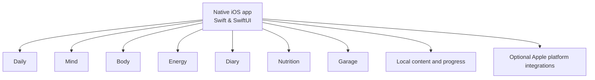

# Architecture

[Back to the showcase](../README.md)

## Public technical overview

OZLife is a native iOS application written in **Swift** and **SwiftUI**. Selected platform-specific interactions may use native iOS bridges where needed.

At a product level, the experience is organized around Daily, Mind, Body, Energy, Diary, Nutrition, and Garage. Structured product content and personal progress are designed primarily for local, on-device use. Optional Apple platform integrations extend selected experiences under user control.

## Deliberate level of abstraction

This diagram and description show product boundaries only. They do not document:

- Concrete classes or source files
- Framework wiring
- Persistence keys or database schemas
- API endpoints or private infrastructure
- Entitlements, signing, purchases, or internal identifiers
- Security implementation details

The production architecture and source code remain private.
